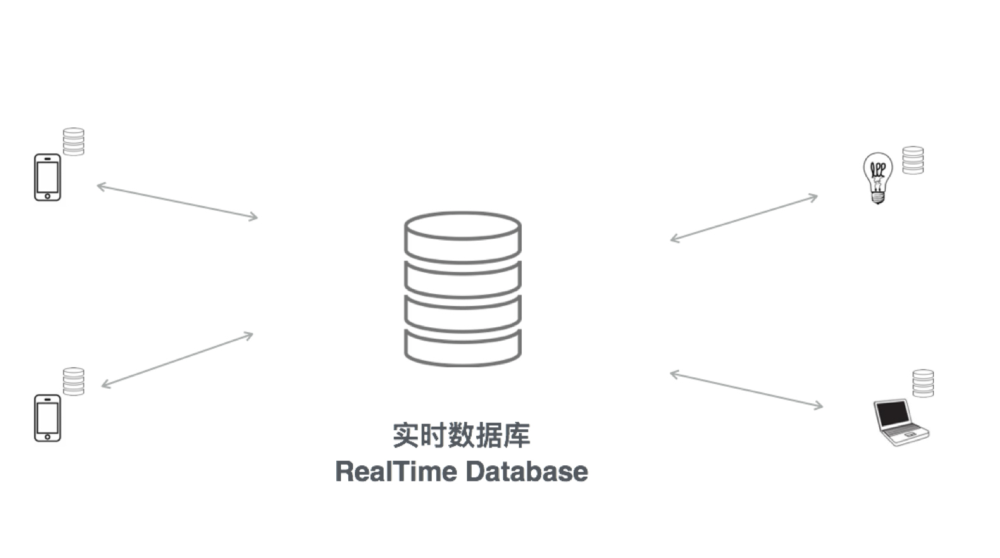

# 实时数据库

野狗的实时数据库可以帮助开发者进行消息的实时传递。它与Firebase完全兼容。后者在全球拥有超过60万名开发者在使用。

使用SDK可以在iOS、Android、Web端对实时数据库进行操作。实时数据库的特别之处在于，在每个客户端上都维护了一个小的数据库副本。这些数据库副本会进行实时同步。任意客户端的数据一旦发生变更，会立刻同步到其它所有客户端。

当对实时数据库进行操作时，会优先对本地进行操作，再同步到云端。这样的本地计算的架构设计可以很好的解决移动互联网的网络环境不稳定的问题。同时，因为总是优先访问本地数据，也很好的起到提升性能的作用。

