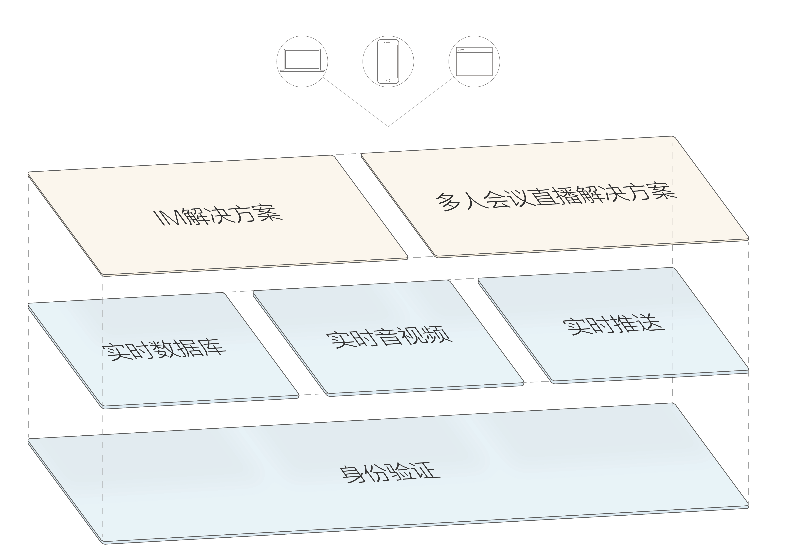

# new_wilddog_docs

野狗新文档，用于Gitbook。欢迎参加项目。

Gitbook地址：  https://macliu010.gitbooks.io/new_wilddog_docs/content/

野狗愿景是成为全球领先的实时通信云服务，让生活因为实时而更加美好。

野狗提供的实时通信服务，目前成熟的产品线有实时数据库（realtime database）和身份认证（authentication）。2016年8月即将推出实时推送（Push）、实时音视频通话（Video／Voice）的公测版本。同时也将会推出在线会议（Webinar）和IM完整解决方案。我们计划在2017年会推出VoIP等业务。

           PS： 图有误，应该是“身份认证”

新版文档将会从原理性开始介绍，和旧版文档不同。
